**Final Dependency Graph**

```mermaid
flowchart TD
    UI["src/app.py<br/>Streamlit UI"] --> Orchestrator["src/agents/orchestrator.py<br/>OrchestratorAgent"]
    UI --> FileManager["src/utils/file_manager.py"]
    UI --> InputValidator["src/security/input_validator.py"]
    UI --> Settings["src/config/settings.py"]

    Orchestrator --> ContextBuilder["src/services/context_builder.py"]
    Orchestrator --> RiskAgent["src/agents/academic_risk_agent.py"]
    Orchestrator --> ScoutAgent["src/agents/opportunity_scout_agent.py"]
    Orchestrator --> BriefingSkill["src/skills/weekly_briefing/skill.py"]
    Orchestrator --> FileManager
    Orchestrator --> Logger["src/utils/logger.py"]
    Orchestrator --> MemoryGuard["src/security/memory_guard.py"]
    Orchestrator --> OutputValidator["src/security/output_validator.py"]

    RiskAgent --> GPARisk["src/skills/gpa_risk/skill.py"]
    ScoutAgent --> ScholarshipSkill["src/skills/scholarship_matching/skill.py"]
    ScoutAgent --> MCPClient["src/mcp_server/scholarship_client.py"]

    MCPClient --> MCPServer["src/mcp_server/scholarship_server.py"]
    MCPServer --> Dataset["src/mcp_server/data/scholarships.json"]

    FileManager --> Profile["memory/student_profile.json"]
    FileManager --> Activity["memory/activity_log.json"]
    FileManager --> Alerts["memory/alert_history.json"]

    MemoryGuard --> ProfileSchema["src/schemas/student_profile_schema.py"]
    MemoryGuard --> ActivitySchema["src/schemas/activity_log_schema.py"]
    MemoryGuard --> AlertSchema["src/schemas/alert_history_schema.py"]

    ProfileSchema --> ProfileModel["src/models/student_profile.py"]
    ActivitySchema --> ActivityModel["src/models/activity_log.py"]
    AlertSchema --> AlertModel["src/models/alert.py"]

    InputValidator --> SecurityRules["src/security/security_rules.py"]
    OutputValidator --> SecurityRules
    MemoryGuard --> SecurityRules
```



Final locked runtime rules:

- Persistent memory is exactly:
  - `memory/student_profile.json`
  - `memory/activity_log.json`
  - `memory/alert_history.json`
- No `session_memory.json`.
- Session state exists only in `st.session_state` or ADK Session Runtime.
- Default model per decisions: `gemini-3.5-flash`.
- Scholarship matching weights:
  - GPA 40%
  - Major 30%
  - Year 20%
  - Tags 10%
- Agent statuses:
  - `SUCCESS`
  - `FAILED`
  - `PARTIAL`
  - `TIMEOUT`
  - `VALIDATION_ERROR`
  - `ROUTING_ERROR`
- Error codes follow the audit spec family: `E1001`, `E2001`, `E3001`, etc.
- MCP server remains under `src/mcp_server/` for scholarship dataset access.

**Final Implementation Roadmap**

Phase 1: Repository Foundation

- Create final `src/` package layout.
- Create locked memory files.
- Create config constants.
- Create package markers where needed.
- Establish dataset location at `src/mcp_server/data/scholarships.json`.

Phase 2: Data Contracts

- Build model files for profile, activity log, and alerts.
- Build schema validators for the three memory files.
- Enforce unknown-field rejection and ISO 8601 UTC timestamps.
- Preserve the locked memory count.

Phase 3: Core Utilities

- Build JSON file manager with atomic writes.
- Build logger that writes activity entries through Orchestrator-controlled flow.
- Add deterministic timestamp and retention behavior.

Phase 4: Security Layer

- Build input validator.
- Build prompt guard.
- Build output validator.
- Build memory guard.
- Centralize constants and permission rules in `security_rules.py`.

Phase 5: Scholarship Dataset Access

- Build MCP scholarship server.
- Build MCP scholarship client.
- Store scholarship data in `src/mcp_server/data/scholarships.json`.
- Validate dataset records against the scholarship dataset contract.

Phase 6: Skills

- Build GPA Risk Assessment Skill.
- Build Scholarship Matching Skill with 40/30/20/10 scoring.
- Build Weekly Briefing Skill with priority order:
  1. Risk alerts
  2. Scholarship deadlines
  3. Academic recommendations

Phase 7: Agents

- Build Academic Risk Agent.
- Build Opportunity Scout Agent.
- Build Orchestrator Agent.
- Enforce: sub-agents never write memory directly.

Phase 8: Streamlit UI

- Build `src/app.py`.
- Initialize Streamlit session state.
- Render profile, dashboard, alerts, scholarships, weekly briefing, activity log, and chat.
- Trigger startup scan/proactive briefing on app load.

Phase 9: Tests

- Test memory persistence.
- Test schemas and security controls.
- Test skill outputs.
- Test agent routing and structured responses.
- Test full startup flow.

**File-By-File Build Order**

1. `src/__init__.py`
2. `src/config/__init__.py`
3. `src/config/settings.py`
4. `memory/student_profile.json`
5. `memory/activity_log.json`
6. `memory/alert_history.json`
7. `src/models/__init__.py`
8. `src/models/student_profile.py`
9. `src/models/activity_log.py`
10. `src/models/alert.py`
11. `src/schemas/__init__.py`
12. `src/schemas/student_profile_schema.py`
13. `src/schemas/activity_log_schema.py`
14. `src/schemas/alert_history_schema.py`
15. `src/utils/__init__.py`
16. `src/utils/file_manager.py`
17. `src/utils/logger.py`
18. `src/security/__init__.py`
19. `src/security/security_rules.py`
20. `src/security/prompt_guard.py`
21. `src/security/input_validator.py`
22. `src/security/output_validator.py`
23. `src/security/memory_guard.py`
24. `src/services/__init__.py`
25. `src/services/context_builder.py`
26. `src/mcp_server/__init__.py`
27. `src/mcp_server/data/scholarships.json`
28. `src/mcp_server/scholarship_server.py`
29. `src/mcp_server/scholarship_client.py`
30. `src/skills/__init__.py`
31. `src/skills/gpa_risk/__init__.py`
32. `src/skills/gpa_risk/skill.md`
33. `src/skills/gpa_risk/skill.py`
34. `src/skills/scholarship_matching/__init__.py`
35. `src/skills/scholarship_matching/skill.md`
36. `src/skills/scholarship_matching/skill.py`
37. `src/skills/weekly_briefing/__init__.py`
38. `src/skills/weekly_briefing/skill.md`
39. `src/skills/weekly_briefing/skill.py`
40. `src/agents/__init__.py`
41. `src/agents/academic_risk_agent.py`
42. `src/agents/opportunity_scout_agent.py`
43. `src/agents/orchestrator.py`
44. `src/app.py`
45. `tests/test_memory.py`
46. `tests/test_security.py`
47. `tests/test_skills.py`
48. `tests/test_agents.py`
49. `requirements.txt`
50. `README.md`

**Exact Repository Tree Expected At Completion**

```text
Student-Operating-System-Agent/
├── README.md
├── requirements.txt
├── memory/
│   ├── student_profile.json
│   ├── activity_log.json
│   └── alert_history.json
├── src/
│   ├── __init__.py
│   ├── app.py
│   ├── agents/
│   │   ├── __init__.py
│   │   ├── orchestrator.py
│   │   ├── academic_risk_agent.py
│   │   └── opportunity_scout_agent.py
│   ├── config/
│   │   ├── __init__.py
│   │   └── settings.py
│   ├── mcp_server/
│   │   ├── __init__.py
│   │   ├── scholarship_server.py
│   │   ├── scholarship_client.py
│   │   └── data/
│   │       └── scholarships.json
│   ├── models/
│   │   ├── __init__.py
│   │   ├── student_profile.py
│   │   ├── activity_log.py
│   │   └── alert.py
│   ├── schemas/
│   │   ├── __init__.py
│   │   ├── student_profile_schema.py
│   │   ├── activity_log_schema.py
│   │   └── alert_history_schema.py
│   ├── security/
│   │   ├── __init__.py
│   │   ├── security_rules.py
│   │   ├── prompt_guard.py
│   │   ├── input_validator.py
│   │   ├── output_validator.py
│   │   └── memory_guard.py
│   ├── services/
│   │   ├── __init__.py
│   │   └── context_builder.py
│   ├── skills/
│   │   ├── __init__.py
│   │   ├── gpa_risk/
│   │   │   ├── __init__.py
│   │   │   ├── skill.md
│   │   │   └── skill.py
│   │   ├── scholarship_matching/
│   │   │   ├── __init__.py
│   │   │   ├── skill.md
│   │   │   └── skill.py
│   │   └── weekly_briefing/
│   │       ├── __init__.py
│   │       ├── skill.md
│   │       └── skill.py
│   └── utils/
│       ├── __init__.py
│       ├── file_manager.py
│       └── logger.py
└── tests/
    ├── test_memory.py
    ├── test_security.py
    ├── test_skills.py
    └── test_agents.py
```
